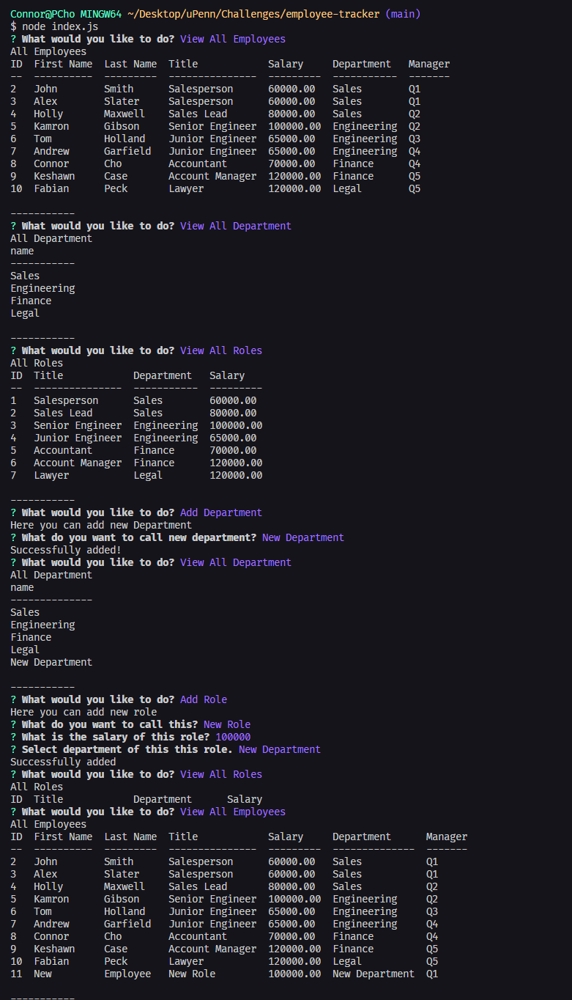

# Employee Tracker

## Description

This app is using mysql2 and inquirer npm to let users to view and modify tables. When user starts the app, user is given a chart to select what they want to do. The choices are to view excising role, department, manager, and employee. Also to add role, department, employee, or modify employee.

## Demo
Link to Demo Video: <a href="https://drive.google.com/file/d/10n7cRV9Q8rhnxRtgiKH_ZEiGokiH1C3e/viewD"> Link to google drive video</a>

## Screenshot
Below is picture of what the app looks like when ran. 

## Tech Used

## Installation
In order to utilize this application, user have to install node.js,
and in addition to node.js, need to install inquirer.js(8.2.4) and Jest. It's done when user types "node i" into the terminal.

## License

N/A

## Contact

<ul>
    <li><b>Email: </b> <a href="connorcho22@gmail.com">connorcho22@gmail.com</a></li>
    <li><b>Github: </b> <a href="https://github.com/connorcho66">connorcho66</a></li>
    <li><b>Linked In: </b> <a href="www.linkedin.com/in/seongyun-cho-89a8a61a0">SeongYun Cho</a></li>
</ul>